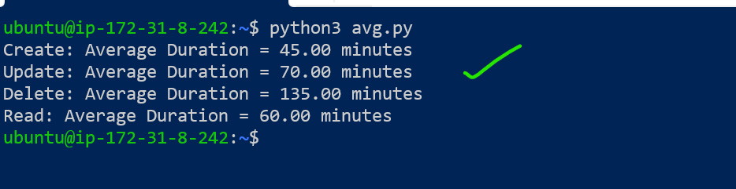
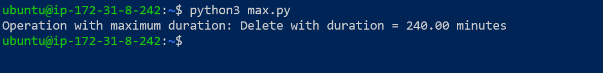
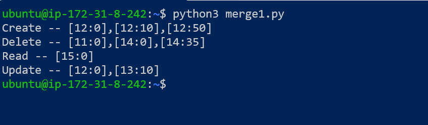

## Log File Analysis
----------------------------------------------------------------------------------------
* You will be given a log file in the format below. 
* The file contains the name of the operation and the time it starts and ends in a
csv format.
* (All time will be in 24:00 time format) We need to perform the below operations on the file:
### 1. Find the avg time of each opeartion - This is termed as the total time taken by each operation divided by the total number of operations?
* `answer:`
```py
import csv
from datetime import datetime

# Sample CSV data as a string for demonstration purposes
csv_data = """Operation,Start,End
Create,12:00,13:00
Create,12:10,13:00
Create,12:20,13:20
Update,12:00,13:10
Create,13:50,14:00
Delete,14:00,14:30
Read,15:00,16:00
Delete,11:00,15:00
"""

# Function to calculate the average duration of operations
def calculate_average_durations(csv_content):
    operation_durations = {}
    operation_counts = {}

    # Read the CSV data
    reader = csv.reader(csv_content.strip().splitlines())
    header = next(reader)  # Skip the header

    for row in reader:
        operation, start_time, end_time = row
        
        # Convert start and end times to datetime objects
        start = datetime.strptime(start_time, '%H:%M')
        end = datetime.strptime(end_time, '%H:%M')
        
        # Calculate duration in minutes
        duration = (end - start).total_seconds() / 60
        
        # Update total duration and count for the operation
        if operation in operation_durations:
            operation_durations[operation] += duration
            operation_counts[operation] += 1
        else:
            operation_durations[operation] = duration
            operation_counts[operation] = 1

    # Calculate average durations
    average_durations = {}
    for operation in operation_durations:
        average_durations[operation] = operation_durations[operation] / operation_counts[operation]

    return average_durations

# Calculate average durations from the CSV data
average_durations = calculate_average_durations(csv_data)

# Print the results
for operation, avg_duration in average_durations.items():
    print(f"{operation}: Average Duration = {avg_duration:.2f} minutes")

```
* `output`:

### 2. Find the operation with the max time- The operation with the maxtime?
* `answer`:
```py
import csv
from datetime import datetime

# Sample CSV data as a string for demonstration purposes
csv_data = """Operation,Start,End
Create,12:00,13:00
Create,12:10,13:00
Create,12:20,13:20
Update,12:00,13:10
Create,13:50,14:00
Delete,14:00,14:30
Read,15:00,16:00
Delete,11:00,15:00
"""

# Function to find the operation with the maximum duration
def find_operation_with_max_duration(csv_content):
    max_duration = 0
    max_operation = None

    # Read the CSV data
    reader = csv.reader(csv_content.strip().splitlines())
    header = next(reader)  # Skip the header

    for row in reader:
        operation, start_time, end_time = row
        
        # Convert start and end times to datetime objects
        start = datetime.strptime(start_time, '%H:%M')
        end = datetime.strptime(end_time, '%H:%M')
        
        # Calculate duration in minutes
        duration = (end - start).total_seconds() / 60
        
        # Check if this duration is the maximum we've seen
        if duration > max_duration:
            max_duration = duration
            max_operation = operation

    return max_operation, max_duration

# Find the operation with the maximum duration from the CSV data
max_operation, max_duration = find_operation_with_max_duration(csv_data)

# Print the result
print(f"Operation with maximum duration: {max_operation} with duration = {max_duration:.2f} minutes")
```
* `output`:

### 3. Merge operations - Here you need to merge overlapping operation into smaller operations.Inshort given an array of intervals where intervals[i] = [starti, endi], merge all overlapping intervals, and return an array of the non-overlapping intervals that cover all the intervals in the input.
* `answer`:
```py
def merge_intervals(intervals):
    if not intervals:
        return []

    # Sort intervals by the start time
    intervals.sort(key=lambda x: x[0])
    
    merged = [intervals[0]]  # Start with the first interval

    for current in intervals[1:]:
        last_merged = merged[-1]

        # If the current interval overlaps with the last merged interval, merge them
        if current[0] <= last_merged[1]:
            last_merged[1] = max(last_merged[1], current[1])  # Merge the intervals
        else:
            merged.append(current)  # No overlap, add the current interval

    return merged

def process_operations(operations):
    merged_operations = {}

    for operation, intervals in operations.items():
        # Merge intervals for each operation
        merged_intervals = merge_intervals(intervals)
        merged_operations[operation] = merged_intervals

    return merged_operations

# Input data
operations = {
    "Create": [[12, 0], [12, 10], [12, 20], [13, 50]],
    "Delete": [[14, 0], [14, 35], [11, 0]],
    "Read": [[15, 0]],
    "Update": [[12, 0], [13, 10]]
}

# Process the operations to merge intervals
merged_operations = process_operations(operations)

# Print the output in the desired format
for operation, intervals in merged_operations.items():
    formatted_intervals = [f"[{start}:{end}]" for start, end in intervals]
    print(f"{operation} -- {','.join(formatted_intervals)}")
```
* `output`:


# sample log file 
----------------------------------------------------------------------------
```csv
Sample Log file
Operation,Start,End
Create,12:00,13:00
Create,12:10,13:00
Create,12.20,13:20
Update,12:00,13:10
Create,13:50,14:00
Delete,14:00,14:30
Read,15:00,16:00
Delete,11:00,15:00
```
## Explanantions:
----------------------------------------------------------------------------------
### `1. Avg Time`
• Avg time taken by different opeartions are :
- Create -- (60+50+60+10)/4 min -->
- Update -- (70)/1 min -->
- Delete -- (30+240)/2 min -->
- Read -- (60)/1 min -->
### `2. Maximum Time`
• Delete took the maximum time
### `3. Merging Operations`
* This is how the input file looks if we club it together by operations:
  - Create -- [12:00,13:00],[12:10,13:00],[12:20,13:20],[13:50,14:00]
  - Delete -- [14:00,14:35],[11:00,15:00]
  - Read -- [15:00,16:00]
  - Update -- [12:00,13:10]
* The output after the merge should look like:
  - Create -- [12:00,13:20],[13:50,14:00]
  - Delete -- [11:00,15:00]
  - Read -- [15:00,16:00]
  - Update -- [12:00,13:10]
